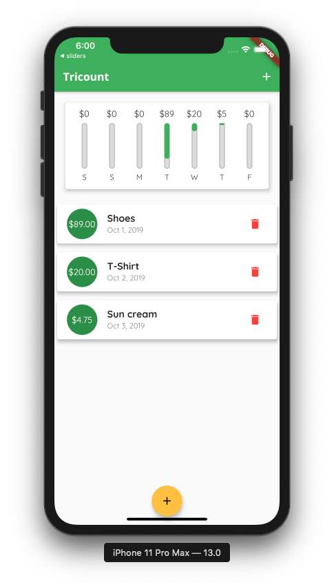

# Tricount clone

A tricount clone made with Flutter.

## Sources
Udemy course : [Learn Flutter & Dart to Build iOS & Android Apps](https://www.udemy.com/course/learn-flutter-dart-to-build-ios-android-apps)

