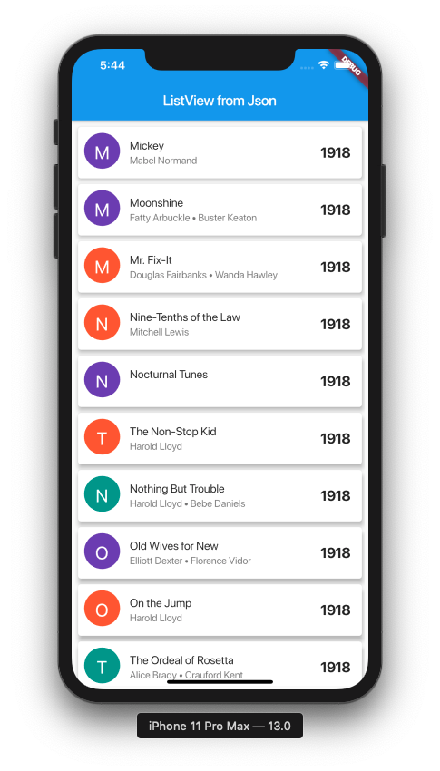

# Create a ListView from Json Data

A Flutter project with a movie list imported from JSON data. 

## Components
- ListView
- CustomPainter

## Sources
Movie list : [wikipedia-movie-data](https://github.com/prust/wikipedia-movie-data)

